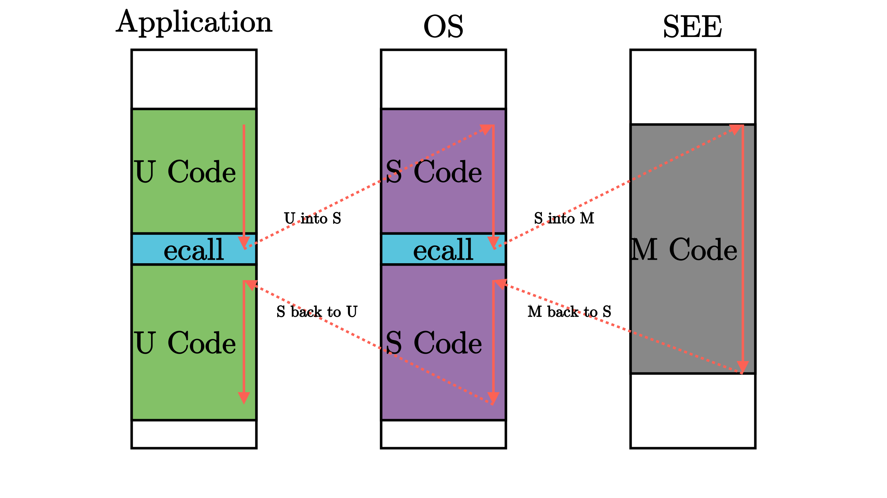

## CPU异常

### x86体系下的异常

#### 常见的CPU异常类型

- **缺页错误（Page Fault）**：缺页错误发生在非法的内存访问操作中。例如：当前指令试图访问没有映射的内存页或试图写入只读的内存页。
- **非法操作码（Invalid Opcode）**：非法操作码发生在当前指令不正确的情况下。例如：试图在不支持 [SSE 指令集](https://en.wikipedia.org/wiki/Streaming_SIMD_Extensions) 的老旧CPU上使用该指令集。
- **通用保护错误（General Protection Fault）**：这是一个触发原因相对宽泛的异常。试图在用户态程序中执行特权指令或试图写入配置寄存器的保留位等非法访问操作均会触发该异常。
- **双重异常（Double Fault）**：异常发生后，CPU会调用对应的异常处理函数。在调用过程中如果发生另一个异常，CPU会触发双重异常。双重异常也会在找不到对应的异常处理函数的情况下发生。
- **三重异常（Triple Fault）**：如果异常发生在CPU调用双重异常处理函数的过程中，这会导致严重的三重异常。我们不能捕获或者处理三重异常。大多数处理器会选择复位并重启操作系统。

#### 中断描述符表（interrupt descriptor table，IDT)

在IDT中，我们可以为每种异常指定一个处理函数

| Type | Name             | Description                                                  |
| ---- | ---------------- | ------------------------------------------------------------ |
| u16  | 函数指针 [0:15]  | 处理函数（handler function)指针的低16位                      |
| u16  | GDT 选择子       | [global descriptor table](https://en.wikipedia.org/wiki/Global_Descriptor_Table) 代码段的选择子 |
| u16  | 选项参数         | 参见下文                                                     |
| u16  | 函数指针 [16:31] | 处理函数（handler function)指针的中间16位                    |
| u32  | 函数指针 [32:63] | 处理函数（handler function)指针剩下的32位                    |
| u32  | 保留位           |                                                              |

|       |                      |                                                              |
| ----- | -------------------- | ------------------------------------------------------------ |
| Bits  | Name                 | Description                                                  |
| 0-2   | 中断栈表索引         | 0: 不切换栈, 1-7:当处理函数被调用时，切换到中断栈表（Interrupt Stack Table）的第n个栈 |
| 3-7   | 保留位               |                                                              |
| 8     | 0: 中断门, 1: 陷阱门 | 如果这个bit被设置为0，处理函数被调用的时候，中断会被禁用。   |
| 9-11  | 必须为1              |                                                              |
| 12    | 必须为0              |                                                              |
| 13‑14 | 特权等级描述符 (DPL) | 允许调用该处理函数的最小特权等级。                           |
| 15    | Present              |                                                              |

当异常发生时，CPU大致遵循下面的流程：

1. 将一些寄存器的内容压入栈中，包括当前指令的指针和[RFLAGS](http://en.wikipedia.org/wiki/FLAGS_register)寄存器的内容（我们会在文章的后续部分用到这些值）。
2. 读取中断描述符表（IDT）中对应的条目。例如：缺页错误发生时，CPU会读取IDT的第十四个条目。
3. 检查这个条目是否存在，如果没有则升级为双重错误（double fault)。
4. 如果条目是一个中断门（第40个bit没有被设置为1），则禁用硬件中断。
5. 装载指定的GDT 选择子到CS段。
6. 跳转到指定的处理函数。

### risc-v体系下的异常

#### 用户态应用程序设计

这里编写了3个应用程序，第一个在屏幕上打印字符串并尝试调用一个s特权级的指令。第二个尝试访问一个非法的物理地址，第三个不断进行计算并打印结果。为了实现打印功能，需要向内核发出打印字符的系统调用，为了程序能正常退出，需要向内核发出退出的系统调用。按照前面内核代码的设计，我们也需要告诉编译器禁止使用标准库，并重新定义程序入口，还需要指定编译程序时的链接脚本，这里需要将起始地址硬编码到0x80400000,这是我们加载应用程序的地址。


#### risc-v特权级切换的原因

用户程序运行在U模式下，操作系统运行在S模式下，在执行运用程序的时候，我们需要为应用程序做一些初始化工作。

- 当启动应用程序的时候，需要初始化应用程序的用户态上下文，并能切换到用户态执行应用程序，即将应用程序放到合适的位置，并将pc指针设置到此处运行
- 当应用程序发起系统调用（即发出Trap ）之后，需要到批处理操作系统中进行处理，当完成系统提供的服务后需要回到应用程序继续执行，此时就需要维持应用程序的上下文保持不变
- 当应用程序执行出错的时候，需要到批处理操作系统中杀死该应用并加载运行下一个应用；
- 当应用程序执行结束的时候，需要到批处理操作系统中加载运行下一个应用（实际上也是通过系统调用 `sys_exit` 来实现的）。

应用程序的上下文包括通用寄存器和栈两个主要部分。 由于CPU 在不同特权级下共享一套通用寄存器，所以在运行操作系统的 Trap 处理过程中，操作系统也会用到这些寄存器，这会改变应用程序的上下文。因此，与函数调用需要保存函数调用上下文活动记录一样，在执行操作系统的 Trap 处理过程（会修改通用寄存器）之前，我们需要在某个地方（某内存块或内核的栈）保存这些寄存器并在Trap 处理结束后恢复这些寄存器。

特权级切换过程一部分硬件会自行完成改变，剩余的需要操作系统进行处理。

#### risc-v中断相关寄存器

通用寄存器：x0~x31

x10~x17 => a0~a7, x1=>ra 

x2=>sp 栈顶寄存器

在触发中断进入S态进行处理时，硬件会将下面的寄存器进行设置

- **sepc**(exception program counter)，它会记录触发中断的那条指令的地址；
- **scause**，它会记录中断发生的原因，还会记录该中断是不是一个外部中断；
- **stval**，它会记录一些中断处理所需要的辅助信息，比如取指、访存、缺页异常，它会把发生问题的目标地址记录下来，这样我们在中断处理程序中就知道处理目标了。
- **stvec**，设置如何寻找 S 态中断处理程序的起始地址，保存了中断向量表基址 BASE，同时还有模式 MODE。当$\text{MODE}=0$，设置为 Direct 模式时，无论中断因何发生我们都直接跳转到基址$\text{pc}\leftarrow\text{BASE}$当$\text{MODE}=1$时，设置为 Vectored 模式时，遇到中断我们会进行跳转如下：$\text{pc}\leftarrow\text{BASE}+4\times\text{cause}$。而这样，我们只需将各中断处理程序放在正确的位置，并设置好 stvec ，遇到中断的时候硬件根据中断原因就会自动跳转到对应的中断处理程序了；
- **sstatus**，S 态控制状态寄存器。保存全局中断使能标志，以及许多其他的状态。可设置此寄存器来中断使能与否。`sstatus`的`ssp`字段会被修改为`cpu`当前的特权级

#### risc-v中断特权指令

`ecall`在s态执行这条指令时，会触发 ecall-from-s-mode-exception，从而进入 M 模式中的中断处理流程（如设置定时器等）在 U 态执行这条指令时，会触发一个 ecall-from-u-mode-exception，从而进入 S 模式中的中断处理流程（常用来进行系统调用）。

**`sret`**,从s态返回u态，即$PC \leftarrow sepc$

**ebreak**(environment break)，执行这条指令会触发一个断点中断从而进入中断处理流程

**mret**，用于 M 态中断返回到 S 态或 U 态，实际作用为$\text{pc}\leftarrow\text{mepc}$

#### risc-v函数调用

| 指令                   | 指令功能         |
| ---------------------- | ---------------- |
| jal rd, imm[20:1]      | rd←pc+4pc←pc+imm |
| jalr rd, (imm[11:0])rs | rd←pc+4          |

在设置PC寄存器完成跳转功能以前，会将当前跳转指令的下一条指令到存在rd寄存器中，在 RISC-V 架构中， 通常使用 `ra` 寄存器（即 `x1` 寄存器）作为其中的 `rd` 对应的具体寄存器，因此在函数返回的时候，只需跳转回 `ra` 所保存的地址即可。事实上在函数返回的时候我们常常使用一条 **伪指令** (Pseudo Instruction) 跳转回调用之前的位置： `ret`

#### 批处理操作系统设计

##### 应用程序管理

1. 将应用程序的二进制镜像文件作为内核的数据段链接到内核中，内核需要知道应用程序的数量以及各个应用程序的位置。对于应用程序的二进制文件信息，我们使用一个build.rs脚本生成，其会读取已经处理过的用户程序的二进制数据，并将其嵌入到汇编代码中，而汇编代码也会被嵌入进内核代码中。产生的汇编代码如下：

   ```makefile
   
       .align 3
       .section .data
       .global _num_app
   _num_app:
       .quad 3
       .quad app_0_start #quad是一个8字节的伪指令
       .quad app_1_start #这里标识了有3个应用程序，并依次放置了3个应用程序二进制数据的起始位置
       .quad app_2_start
       .quad app_2_end
   
       .section .data
       .global app_0_start
       .global app_0_end
   app_0_start:#//第一个应用程序的二进制数据
       .incbin "../user/target/riscv64gc-unknown-none-elf/release/00hello.bin"
   app_0_end:
   ......
   
   ```

   

2. 管理各个应用程序的进入与离开，我们使用一个`AppManager`结构体管理

   ```rust
   struct AppManager {
       inner: RefCell<AppManagerInner>,
   }
   struct AppManagerInner {
       num_app: usize,//app数量
       current_app: usize, //当前的app
       app_start: [usize; MAX_APP_NUM + 1], //app的起始地址
   }
   ```

应用的的初始化关键代码

```rust
lazy_static! {
    static ref APP_MANAGER: AppManager = AppManager{
        inner: RefCell::new({
            extern "C"{ fn _num_app();}
            //取出app所在位置的地址
            //link_apps按8字节对其
            let num_app_ptr = _num_app as usize as *const usize;//取地址
            let num_app = unsafe{ num_app_ptr.read_volatile()};//读内容 =3
            let mut app_start :[usize;MAX_APP_NUM+1] = [0;MAX_APP_NUM+1];
            let app_start_raw:&[usize] = unsafe{
                //形成一个指针切片，存放的三个应用的起始地址和最后一个应用的开始地址
                from_raw_parts(num_app_ptr.add(1),num_app+1)
            };
            app_start[..=num_app].copy_from_slice(app_start_raw);//复制地址
            AppManagerInner{
                num_app,
                current_app:0,
                app_start,
            }//初始化
        }),
    };
}
```

初始化完管理器，就可以加载应用程序，这里需要注意的是fence.i指令，其负责清除cpu中的指令缓存，由于我们切换了应用程序，其各个地址上的指令已经不是原来的了，如果不清除缓存里面的数据，那么在下次访问某个地址上的指令时就会发生执行上一个应用程序指令的情况。

```rust
    unsafe fn load_app(&self, app_id: usize) {
        if app_id >= self.num_app {
            panic!("All application completed!");//保证不会加载不存在的应用程序
        }
        println!("[kernel] Loading app_{}", app_id);
        //重要 clear i-cache
        asm!(
            "fence.i",
            options(nostack)
        );
        //清除应用程序段
        (APP_BASE_ADDRESS..APP_BASE_ADDRESS + APP_SIZE_LIMIT).for_each(|addr| 
            (addr as *mut u8).write_volatile(0); //取地址并写入0，以字节写入
        });
        let app_src = core::slice::from_raw_parts(
            self.app_start[app_id] as *const u8,//起始地址
            self.app_start[app_id + 1] - self.app_start[app_id],//长度，以字节记
        );//获取应用二进制数据
        let app_dst = core::slice::from_raw_parts_mut(APP_BASE_ADDRESS as *mut u8, app_src.len());//将要写入应用二进制数据的位置
        app_dst.copy_from_slice(app_src); //写入数据
    }
```

##### 用户栈与内核栈

在中断/异常/系统调用发生的时候，`cpu`就会trap切换到S态并跳转到`stvec`指向的位置进行相关的处理。而在进入S态之前，操作系统需要完成对上面所提到的应用程序上下文进行保存，而这些信息需要保存在操作系统的内核栈中。

使用中断栈帧来保存trap上下文

```rust
#[repr("C")]
pub struct TrapFrame{
    pub reg:[usize;32],//32个通用寄存器
    pub sstatus:Sstatus,
    pub sepc:usize,
}
```

特权级切换的核心是对Trap的管理

- 应用程序通过 `ecall` 进入到内核状态时，操作系统保存被打断的应用程序的Trap 上下文；
- 操作系统根据Trap相关的CSR寄存器内容，完成系统调用服务的分发与处理；
- 操作系统完成系统调用服务后，需要恢复被打断的应用程序的Trap 上下文，并通 `sret` 让应用程序继续执行。

上下文保存恢复的汇编代码

```asp
_alltraps:
    csrrw sp, sscratch, sp #交换sp和sscratch，此时sp是内核栈顶地址，sscratch是用户栈顶地址
    addi sp, sp, -34*8 #开辟一部分空间保存寄存器
    sd x1, 1*8(sp)
    sd x3, 3*8(sp)
    .set n, 5
    .rept 27
        SAVE_GP %n
        .set n, n+1
    .endr 
    csrr t0, sstatus 
    csrr t1, sepc
    sd t0, 32*8(sp) #保存sstatus的值
    sd t1, 33*8(sp) #保存sepc的值
    
    csrr t2, sscratch
    sd t2, 2*8(sp)
    #让寄存器a0保存sp的值，即栈顶指针
    mv a0, sp
		#让a0保存这个上下文的起始地址，在trap_handle中需要基于此进行trap的分发
    call trap_handler

_restore:
    # 把sp的地址重新设置为栈顶地址
    mv sp, a0
    ld t0, 32*8(sp)
    ld t1, 33*8(sp)
    ld t2, 2*8(sp)
    csrw sstatus, t0
    csrw sepc, t1
    csrw sscratch, t2
    ld x1, 1*8(sp)
    ld x3, 3*8(sp)
    .set n, 5
    .rept 27
        LOAD_GP %n
        .set n, n+1
    .endr #恢复所有寄存器的值
    addi sp, sp, 34*8 #释放栈空间
    csrrw sp, sscratch, sp #再次交换两个寄存器，此时sp指向了用户栈
    sret #返回用户态
```

##### 应用程序执行的完整过程

第一步，设置好中断/异常/系统调用进入trap时进行相应处理的入口。

```rust
trap::init();//trap初始化，设置stvec的入口地址
++++++++++++++++++++
pub fn init(){
    unsafe {
        extern "C"{
            fn _alltraps();
        }
        stvec::write(_alltraps as usize,stvec::TrapMode::Direct);
        // sstatus::set_sie();//s态全局使能位
    }
    println!("++++ setup trap! ++++");
}
```

第二步，初始化应用管理器，获取应用的相关信息，即开始位置，结束位置。

```rust
//初始应用管理器，答应应用地址
 batch::init();
```

第三步，准备进入用户态开始运行程序。在run_next_app()中，我们按顺序加载应用到相应的位置，然后复用_restore_函数，我们将sepc的寄存器设置为程序的入口地址，将特权级模式设置为用户模式，在内核栈执行完push_context（）操作后，此时sp寄存器是用户栈地址，而pc指针由于执行了sret指令已经变成了sepc寄存器的内容即用户程序的入口，因此此时就会转到用户程序执行。

```rust
batch::run_next_app();
++++++++++++++++
pub fn run_next_app() ->!{
    let current_app = APP_MANAGER.inner.borrow().current_app;
    unsafe {
        APP_MANAGER.inner.borrow().load_app(current_app);//加载application到0x80400000位置开始运行
    }
    //设置下一个应用
    APP_MANAGER.inner.borrow_mut().move_to_next_app();
    extern "C"{
        fn _restore(cx_addr:usize); //定义外部接口，来自trap.asm用于恢复上下文
    }
    // 复用_restore函数
    // 在内核栈上压入一个Trap上下文
    // sepc 是应用程序入口地址 0x80400000 ，
    // 其 sp 寄存器指向用户栈，其sstatus 的 SPP 字段被设置为 User 。
    // push_context 的返回值是内核栈压入 Trap 上下文之后的内核栈顶，
    // 它会被作为 __restore 的参数
    unsafe {
        // println!("[kernel] Begin run application!");
        _restore(KERNEL_STACK.push_context(
            TrapFrame::app_into_context(
                APP_BASE_ADDRESS,
                USER_STACK.get_sp()))as * const _ as usize
        );
        //此时sp指向的是用户栈地址，sscratch指向的是内核栈地址
    }
    panic!("The end of application");
}
```

在应用程序发起系统调用或触发一些中断时，就会进入trap处理入口，`pub fn trap_handler(tf:&mut TrapFrame)->&mut TrapFrame`函数会工具中断原因进行分发处理，并在必要时结束某些应用运行下一个应用。

最后整个操作系统的运行过程如下所示


#### risc-v常见的trap类型

- 访问错误异常 当物理内存的地址不支持访问类型时发生（例如尝试写入 ROM）。

- 断点异常 在执行 ebreak 指令，或者地址或数据与调试触发器匹配时发生。
- 环境调用异常 在执行 ecall 指令时发生。
- 非法指令异常 在译码阶段发现无效操作码时发生。
- 非对齐地址异常 在有效地址不能被访问大小整除时发生，例如地址为 0x12 的
  amoadd.w

中断时 mcause 的最高有效位置 1，同步异常时置 0，且低有效位标识了中断或异常的具体原因。只有在实现了监管者模式时才能处理监管者模式中断和页面错误异常

#### 特权级机制的原因

如果将应用程序与操作系统内核代码放在一起执行，那么带来的后果就是应用程序可以任意的访问本该只有内核才能访问的内容，而且应用程序还可以篡改系统的各种功能，这就会导致内核的不安全性。而如果将应用程序与内核在不同特权级上执行，就可以避免应用程序使用内核才可以使用的指令，应用程序必须通过特权级转换，才能使用内核为其提供的功能。

#### risc-v特权级架构

risc-v提供了4中特权级，但实验中只涉及到S和U特权级，M特权级已经由RustSBI实现。应用程序运行于U特权级，内核运行于S特权级，因此当用户程序执行时产生一些错误或者向系统提出请求时就需要暂停应用程序的执行，转到S特权级的去执行相应的代码，这是一种不同于传统的函数调用的异常控制流，因为传统的调用不涉及到特权级的切换，而异常控制流需要做更多工作。在risc-v体系下有不同的异常产生原因，包括缺页错误，非法访问，系统调用，断点等。这一节的实验主要关注系统调用ecall,这是应用程序可以向内核请求资源和功能的关键。

下图是一个应用程序通过ecall 进入内核的示意图。


