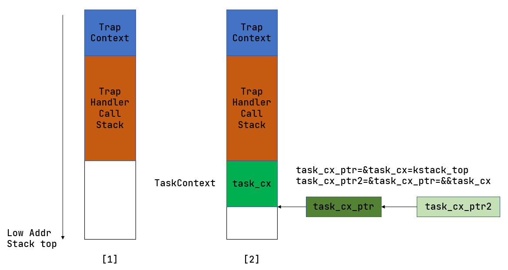
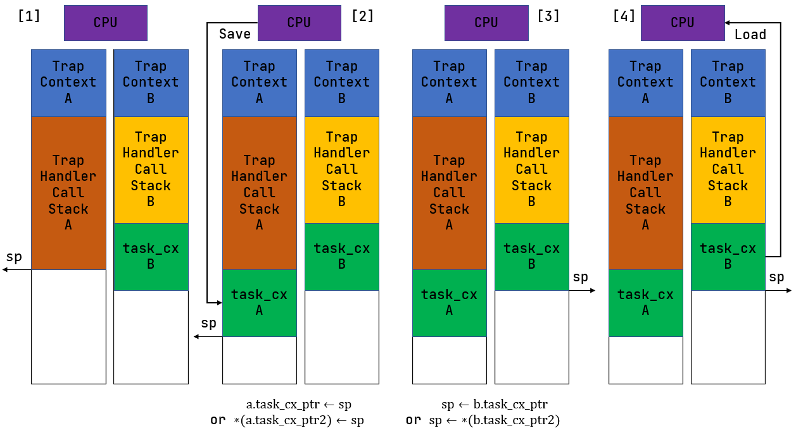
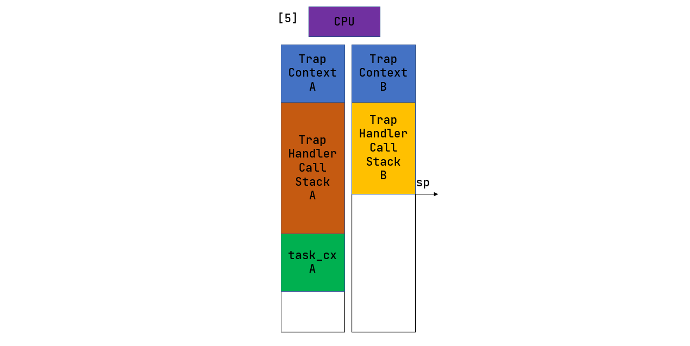
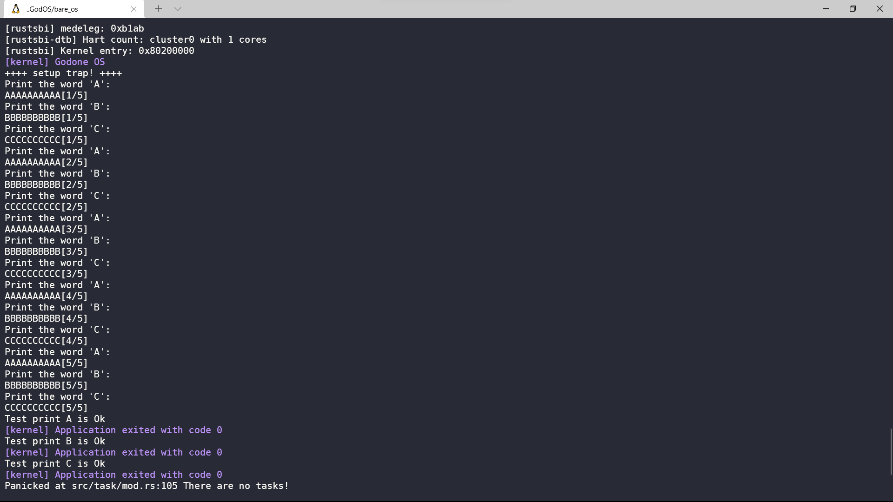
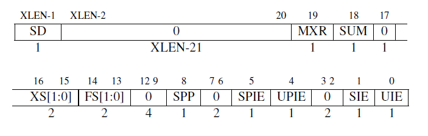
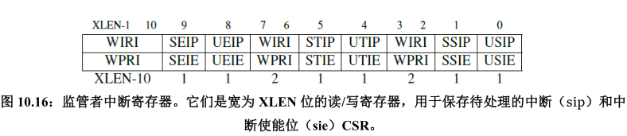
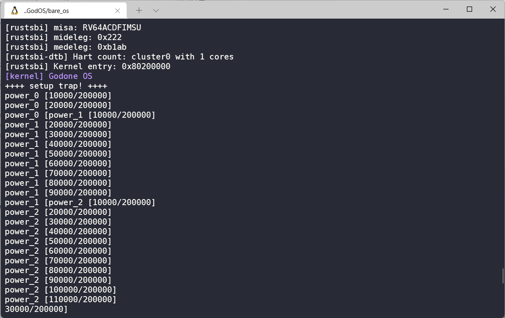

### 多道程序与分时多任务

---

在之前的实验中，我们已经完成了一个简单的批处理操作系统，通过依次加载每一个程序，然后再运行的过程，我们可以控制程序的有序进出。同时在硬件特权级机制的支持下，我们也实现了操作系统与应用程序运行在不同的特权级。但此时的批处理操作系统的效能却非常低，第一个原因就是cpu资源得不到有效的利用，如果一个应用程序处在I/O过程中，并没有使用cpu进行计算，那么此时cpu就会停下来，这对于计算机是一个极大的浪费，而且随着计算机内存的增大，内存可以存放的应用程序也会越来越多，每次只加载一个程序显得非常缓慢。为了解决这些问题，这次实验将设计一个可以充分利用资源的操作系统。我们将分为三个小步骤依次完成。

- [x] 多道程序
- [x] 多道程序协作

- [x] 多道程序分时抢占

[toc]

#### 多道程序

由于计算机内存的增大，不再是以前的几十kb，因此我们没有必要每次只加载一个应用到内存中，我们将所有程序一次性读入内存中，这样在切换应用程序的时候就不用再次进行io，大大减少了时间。但此时我们的操作系统并不具备动态加载应用程序的能力，因此我们需要手动进行加载。而在之前的实验中，我们使用的是一个约定的应用起始地址0x80400000，然后所有的应用程序的地址就会被从此地址开始链接。

> # 链接
>
> 程序的链接过程分为动态链接和静态链接。
>
> 动态链接：
>
> - 加载时链接，即在程序加载到内存时链接
> - 运行时链接，在程序运行的过程中边运行边链接
>
> 静态链接：编译时执行链接过程

我们现在需要为每一个应用程序分配一个合适的空间，即合适的起始地址，这样每个程序就可以被直接加载到内存中的对应位置，因此我们编写一个脚本来在运行操作系统前动态地编译各个应用程序。代码的主要部分就是下面的三句，每次编译程序前将链接脚本中的起始地址更改为指定地址即可。

```python
base_address = 0x80400000
app_address = 0x20000
new_text = line.replace(hex(base_address),hex(base_address+app_address*i))
```

同样的改变也发生在加载应用程序的过程中，需要将每个应用程序加载到上面对应的内存地址上，其它的操作与之前的保持一致。

#### 多道程序协作

多道程序完成了让应用程序一次性加载到内存，减少io时间的目标，但是仔细一想，好像cpu的时间还是没有得到有效的使用，一个程序只有出错或者退出了才会轮到下一个应用执行，为了提高cpu的利用率，我们就得想别的办法，而一个最单纯的想法就是能不能让程序在处于一些非必要计算的情况停下来，转而执行其它程序，等执行完其它程序后再回来继续执行当前的程序，虽然这需要编写代码人主动在代码中嵌入让程序暂停执行的系统调用。

而为了完成上述说的协作过程，一个程序的运行过程就会被拆成一个个阶段，每一阶段叫==任务==。而要完成应用程序的暂停->执行->暂停的过程，就需要完成==任务切换==，与之前的trap上下文一样，这里也有一个==任务上下文==。

> # 任务切换与trap切换的差异
>
> + 不涉及特权级切换；
> + 任务切换的一部分是由编译器帮忙完成的；
> + 任务切换对应用是透明的。

###### 任务切换的核心机制

任务切换发生在不同应用在内核中的trap控制流之间，在应用程序发生异常或者系统调用时进入内核态进行处理，这个时候我们就可以控制处理流程让原来的Trap控制流暂停下来，切换到另一个程序的Trap控制流，最后在某一个Trap控制流我们又回到之前那个未完成的控制流继续执行，与之前trap切换不同，我们此时只是在调用一个函数，而这个函数执行的只是在内核栈上切换，不用切换内核栈与用户栈。



我们在内核中实现的切换函数是`__switch()`，上图是Trap控制流准备调用此函数进行内核栈之间切换的过程，左图中是在进行Trap处理过程中产生的调用栈信息，一部分来自于之前保存的trap上下文，一部分是调用函数产生的调用栈信息，而我们要切换到其它内核栈上之后又要回来，那我们就得保存一下当前的现场，具体而言就是一些寄存器信息，这些信息称作==任务上下文==。在将这些信息继续压入当前应用内核栈后，我们就可以切换到另一个应用程序的内核栈上了。`task_cx_ptr`就是task上下文的栈顶地址。






Trap控制流的调用`__switch`的整个流程如上图所示

+ 阶段 [1]：在 Trap 控制流 A 调用 `__switch` 之前，A 的内核栈上只有 Trap 上下文和 Trap 处理函数的调用栈信息，而 B 是之前被切换出去的，它的栈顶还有额外的一个任务上下文
+ 阶段 [2]：A 在自身的内核栈上分配一块任务上下文的空间在里面保存 CPU 当前的寄存器快照。随后，我们更新 A 的 `task_cx_ptr` （需修改 `task_cx_ptr2` 的内容）
+ 阶段 [3]：这一步极为关键。这里读取 B 的 `task_cx_ptr` 或者说 `task_cx_ptr2` 指向的那块内存获取到 B 的内核栈栈顶位置，并复制给 `sp` 寄存器来换到 B 的内核栈。由于内核栈保存着它迄今为止的执行历史记录，可以说 **换栈也就实现了控制流的切换** 。正是因为这一步， `__switch` 才能做到一个函数跨两条控制流执行。
+ 阶段 [4]：CPU 从 B 的内核栈栈顶取出任务上下文并恢复寄存器状态，在这之后还要进行函数返回的退栈操作。
+ 阶段 [5]：对于 B 而言， `__switch` 函数返回，可以从调用 `__switch` 的位置继续向下执行。

下面是`___switch`的实现，相关的注释在代码中。

```gas
.altmacro
.macro SAVE_SN n
    sd s\n, (\n+1)*8(sp)
.endm
.macro LOAD_SN n
    ld s\n, (\n+1)*8(sp)
.endm
    .section .text
    .globl __switch
__switch:
    # __switch(
    #     current_task_cx_ptr2: &*const TaskContext, 当前task控制流
    #     next_task_cx_ptr2: &*const TaskContext 切换目的task控制流
    # )
    # current_task_cx_ptr2位于a0 寄存器
    # next_task_cx_ptr2 位于a1寄存器

    addi sp, sp, -13*8 #开辟一部分空间保存当前的现场
    sd sp, 0(a0) #将sp的值放入a0寄存器中,保存task栈顶的位置
   
    sd ra, 0(sp) #将ra返回地址保存在sp指向的栈顶上，ra的地址其实就是函数返回后执行的指令地址
    .set n, 0 #保存s0-s11
    .rept 12
        SAVE_SN %n
        .set n, n + 1
    .endr
    #加载切换的应用程序的任务上下文
    ld sp, 0(a1) #将a1的值加载到sp，即此时sp指向下一个task栈顶
   
    ld ra, 0(sp) #加载返回地址
    .set n, 0 #恢复寄存器
    .rept 12
        LOAD_SN %n
        .set n, n + 1
    .endr
    
    addi sp, sp, 13*8 #恢复sp位置
    ret #函数返回，此时pc就会读取ra的内容了
```

需要我们保存的任务上下文内容为下面所示：

```rust
/// 任务上下文
/// 对于一般的函数，编译器会在函数的起始位置自动生成代码保存 被调用者保存寄存器
/// _switch函数不会被编译器特殊处理，因此我们需要手动保存这些寄存器
/// 而其它寄存器不保存时因为属于调用者保存的寄存器是由编译器在高级语言编写
/// 的调用函数中自动生成的代码来完成保存的；还有一些寄存器属于临时寄存器，
/// 不需要保存和恢复。
pub struct TaskContext {
    //ra: 此寄存器存储的是函数返回时跳转的地址
    //在调用函数返回指令 sret时,Pc指针会取出ra里面的地址
    ra: usize,
    s: [usize; 12],
}
```

在完成上面的这些工作后，我们就要准备管理这些任务了，我们可以给每个任务标定一个运行状态

- 未初始化
- 准备执行
- 正在执行
- 已退出

我们也为程序增加一些系统调用，`sys_yield`和`sys_exit`，分别用于程序暂停和退出。

> # 说明
>
> 这种用于程序员自行决定应用程序暂停和退出的方法是不科学的，毕竟不是每个编写程序的人都会有这种自觉性，看来还是操作系统对其管理比较恰当。

接下来一个主要的函数就是`run_next_task`

```rust
    fn run_next_task(&self) {
        if let Some(next) = self.find_next_task() {
            //查询是否有处于准备的任务，如果有就运行
            //否则退出
            let mut inner = self.inner.borrow_mut();
            let current_task = inner.current_task;
            inner.current_task = next;
            inner.tasks[next].task_status = TaskStatus::Running;
            //获取两个任务的task上下文指针
            let current_task_cx_ptr2 = inner.tasks[current_task].get_task_cx_ptr2();
            let next_task_cx_ptr2 = inner.tasks[next].get_task_cx_ptr2();

            //释放可变借用，否则进入下一个任务后将不能获取到inner的使用权
            core::mem::drop(inner);
            unsafe {
                __switch(current_task_cx_ptr2, next_task_cx_ptr2);
            }
        }
        else {
            panic!("There are no tasks!");
        }
    }
```

其中`find_next_task()`就是简单地遍历所有管理的应用程序，如果当前其处于准备状态就拿出来运行而已。这里是一个可以修改的地方，因为这种简单的任务调度方式可能会导致最先开始运行的程序要很久才能得以继续运行，这显然是不公平的。

在开始进入用户态运行应用程序前，我们需要像之前构造一个Trap上下文复用`_restore`函数一样在这里构造一个task上下文，使得cpu能从内核态切换到用户态。

```rust
/// 最重要的函数
/// 用于初始化相关的设置
pub  fn init_app_cx(app: usize) -> &'static TaskContext {
    //返回任务的上下文
    KERNEL_STACK[app].push_context(
        //首先压入trap上下文，再压入task上下文
        TrapFrame::app_into_context(get_base_address(app),USER_STACK[app].get_sp()),
        TaskContext::goto_restore(),
    )
}
```

这里的app_into_context我们不在叙述，属于前面的构造的trap上下文，而task上下文的构造如下所示

```rust
/// 在应用第一次运行时，我们需要为其构造一个任务上下文
/// 将ra设置为_restore的地址，那么在应用执行完__switch后，就会返回到_restore
/// 此时就转变为初始化一个trap上下文的情况了。
impl TaskContext {
    pub fn goto_restore()->Self{
        extern "C" { fn _restore();}
        Self{
            ra: _restore as usize,
            s:[0;12]
        }
    }
}
```

所有东西都已经准备完毕后，我们就可以运行应用程序了，这个时候出现的问题就是我们使用`___switch`来切换不同的trap控制流，但第一个应用程序其前面没有控制流了，这里有两种解决方法，一种是设置当前要切换的目标控制流是第二个应用程序的，这种方法导致的后果就是第一个应用程序可能会在很久之后才得以运行，另一种方法就是容易指定一个内核地址作为当前应用程序的task上下文地址，第一个应用程序的作为目的task上下文地址，这样虽然我们做了一些无意义的任务上下文保存工作，但是解决了第一个应用程序不能首先执行的问题。

```rust
 fn run_first_task(&self){
        self.inner.borrow_mut().tasks[0].task_status = TaskStatus::Running;
        let next_task_ptr2 = self.inner.borrow().tasks[0].get_task_cx_ptr2();
        let _unused :usize = 0; //任意指定的当前应用程序task上下文地址
        unsafe {
            __switch(&_unused as *const usize,next_task_ptr2);
        }
    }
```

重新编写三个应用程序来检验这个多道程序协作操作系统

```rust
fn main()->i32{
    for i in 0..HEIGHT{
        println!("Print the word 'A': ");
        for _ in 0..WIDTH {
            print!("A");
        }
        println!("[{}/{}]",i+1,HEIGHT);
        yield_();//暂停应用
    }
    println!("Test print A is Ok");
    0
}
```

其它两个与之类似，都是答应一些字符，然后暂停当前程序，内核会将应用程序任务标记为准备状态，然后切换下一个应用程序任务执行。



#### 分时多任务

多道程序协作的使用，使得cpu的利用效率变得更高了，但是之前也提到了多道程序协作是需要编写应用程序的人主动进行让出cpu资源的动作，这带来许多不确定性，因此我们采用新的方法，我们编写的操作系统直接管理所有应用程序的运行，使用==时间片转轮调度==来管理各个应用程序的运行--即每一个应用程序运行一个时间片后，将会被强制性让出来，切换到下一个应用程序任务。

时间片轮转法依赖于时钟中断。

> # 中断特权级
>
> risc-v中断类型：
>
> + **软件中断** (Software Interrupt)：由软件控制发出的中断
> + **时钟中断** (Timer Interrupt)：由时钟电路发出的中断
> + **外部中断** (External Interrupt)：由外设发出的中断
>
> 中断特权级：
>
> + 如果中断的特权级低于 CPU 当前的特权级，则该中断会被屏蔽，不会被处理；
> + 如果中断的特权级高于与 CPU 当前的特权级或相同，则需要通过相应的 CSR 判断该中断是否会被屏蔽。

> # risc-v s特权级相关csr寄存器
>
> 
>
> 1. sstatus ,其中的sie位控制s态的中断使能，0时会屏蔽三种中断。
>
>    
>
> 2. sie 寄存器中，它的三个字段 `ssie/stie/seie` 分别控制 S 特权级的软件中断、时钟中断和外部中断的中断使能
>
> 3. mtime 寄存器，保存了cpu上电以来经历的时钟周期数
>
> 4. mtimecmp，保存了一个阈值，当mtime的值超过这个值时，会触发一个时钟中断。

在发生中断后，sstatus.sie会被设置为1，然后保存到sstatus.spie中，然后sstatus.sie会被设置为0 ，这时为了在处理当前中断的时候避免其它中断触发。当中断程序处理完成后，调用sret回到原来中断的位置继续执行，此时sstatu.sie = sstatus.spie。

有了这些寄存器和时钟中断的帮助，我们就可以通过设置mtimecmp的值，来形成一个个时钟周期，从而在每个时钟周期中运行一个应用程序的任务。

```rust

//S态时钟处理函数
fn supertimer_handler() {
    set_next_timetrigger(); //当发生时钟中断后，设置下一个时钟周期。
    suspend_current_run_next();//暂停当前任务，运行下一个任务。
}
```

```rust
#[no_mangle]
extern "C" fn rust_main() -> ! {
    clear_bss();
    INFO!("[kernel] Godone OS");
    //trap初始化，设置stvec的入口地址
    trap::init();
    //运行程序
    loader::load_app();
    timer::enable_timer_interrupt(); //使能位
    timer::set_next_timetrigger();//运行应用程序前先设置时钟周期
    task::run_first_task();
    panic!("The main_end!");
}

```

我们编写四个应用程序来检验这个操作系统，其中三个需要cpu进行计算的应用程序如下：

```rust
fn main() -> i32 {
    let p = 3u64;
    let m = 998244353u64;
    let iter: usize = 200000;
    let mut s = [0u64; LEN];
    let mut cur = 0usize;
    s[cur] = 1;
    for i in 1..=iter {
        let next = if cur + 1 == LEN { 0 } else { cur + 1 };
        s[next] = s[cur] * p % m;
        cur = next;
        if i % 10000 == 0 {
            println!("power_0 [{}/{}]", i, iter);
        }
    }
    println!("{}^{} = {}", p, iter, s[cur]);
    println!("Test power_0 OK!");
    0
}
```



可以看到，这些程序在运行过程中由于时钟中断的到来会被无情打断，转而运行其它程序任务。这样我们的分时多任务操作系统就完成了。

