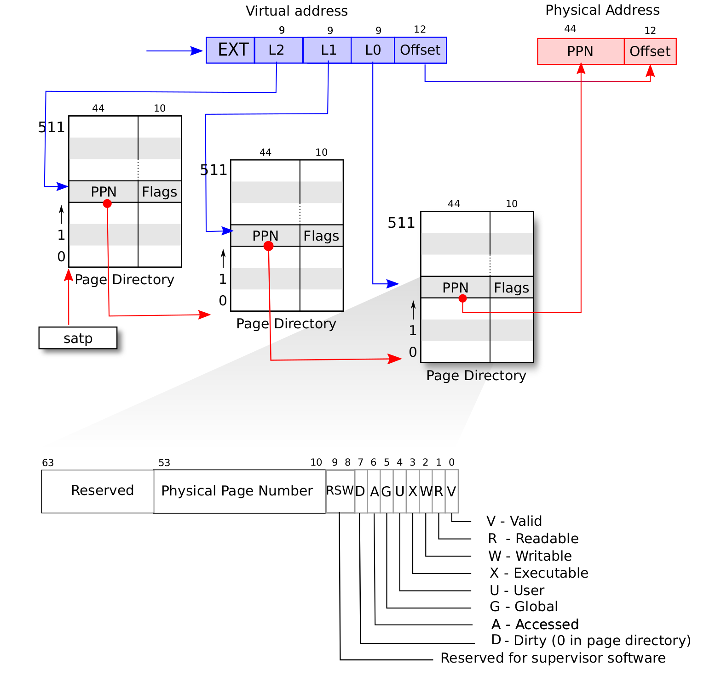

## 动态内存分配与虚拟地址空间

----


[toc]

在完成了多道应用程序(即充分利用内存空间，将所有的应用程序加载到内存中，一个接一个地运行完成)，分时多任务系统（即多个任务交替运行）后，这一节实验我们完成的是一个不需要指定应用程序内存布局，将其固定到特定位置，而是通过虚拟地址空间的抽象，动态加载应用程序到内存中，通过基于段页式虚拟地址空间的内存映射机制，还进一步加强了应用于内核的隔离。

在日常的使用操作系统过程中，运行一个程序时，其给人的直接感受就是此时这个应用程序独占cpu，但实际上，cpu是通过时分复用的方法，即交替地运行许多应用程序，但由于其切换的速度很快，肉眼来说我们仍然觉得cpu就是为当前这个应用程序服务。

首先需要的第一个问题即是如何充分利用内存空间，在前面完成的操作系统中，所有的应用被加载到内存指定位置，内核代码于用户程序代码均可以访问整个内存空间，这会导致用户程序有机会篡改内核代码，带来一系列错误。现代操作系统均使用基于段页式的地址空间映射方式，每个程序在其所拥有的地址空间空间中可以做任何事，但其不能访问其它应用程序的和内核的地址空间内容。

为了完成这个任务，需要解决下列的一系列问题

+ 硬件中物理内存的范围是什么？
+ 哪些物理内存空间需要建立页映射关系？
+ 如何建立页表使能分页机制？
+ 如何确保OS能够在分页机制使能前后的不同时间段中都能正常寻址和执行代码？
+ 页目录表（一级）的起始地址设置在哪里？
+ 二级/三级等页表的起始地址设置在哪里，需要多大空间？
+ 如何设置页目录表项的内容？
+ 如何设置其它页表项的内容？
+ 如果要让每个任务有自己的地址空间，那每个任务是否要有自己的页表？
+ 代表应用程序的任务和操作系统需要有各自的页表吗？
+ 在有了页表之后，任务和操作系统之间应该如何传递数据？

总体的实现思路如下：

1. 将应用程序的内存布局起始地址改为0，使其与现代操作系统的结果保持一致
2. 在内核中实现动态内存分配[跳转](1)
3. 编写页表项和，地址空间，段等数据结构抽象
4. 建立虚拟内存映射关系，将虚拟空间的地址映射到真实的物理地址的实现
5. 为内核地址空间建立映射关系
6. 为用户程序地址空间建立映射关系，这里需要解析ELF文件
7. 重新构建用户程序任务管理器
8. 重新配置trap与任务切换，从而使得任务切换与异常可以正常使用，这里设计到指令平滑的思想。
9. 为内核访问用户空间的数据建立相应的函数功能，内核代码需要访问用户空间缓冲区的内容。


### <a name = “1">内存动态分配</a>

前面内核代码中的所有变量，数据结构都是静态分配在内存中的，即在编译时期已经确定了他们的大小和在内存的位置，而大多数时候我们需要的是可以动态申请内存，即编译时期不能确定大小的数据，而动态内存就是操作系统维护的堆，要实现堆分配，需要我们占用内存的一部分，为其实现函数接口提供给操作系统使用和回收。在实现时需要注意内存碎片的问题，但这也是不可避免的。

在rust中，标准库中有许多可以直接使用的基于堆的数据结构，包括map、Box、list、string以及其它一系列智能指针等，但这些都是建立在一个完整的操作系统之上的，即操作系统需要完成许多的工作才能使用这些数据结构，我们的操作系统暂时不能达到可以使用标准库的地步，但我们可以借助rust的优势，实现内存分配的算法，在实现了动态分配内存后就可以实现上面所说的各种数据结构。在rust中核心库定义了alloc需要实现的接口，实现了这些接口并为其提供一个全局的动态内存分配器就大功告成了。

需要实现的两个接口如下：

```rust
pub unsafe fn alloc(&self, layout: Layout) -> *mut u8;
pub unsafe fn dealloc(&self, ptr: *mut u8, layout: Layout);
```

alloc需要根据layout(其包含了申请的内存大小和地址对齐方式，地址对齐方式就是保证返回的起始地址是申请的空间单个元素大小的倍数)返回申请到的内存地址，失败则返回空，dealloc负责将不需要使用的堆回收。

我们不使用现成的分配器即使其实现比较完美，此处根据其它教程，完成了两个简单一点的分配器。

第一个是`bump`分配器，其数据结构如下：

```rust
pub struct BumpAllocator {
    start_heap: usize,
    end_heap: usize,
    next: usize,
    allocations: usize, //计数器
}
```

bump分配器需要一个计数器和next指示器来完成内存分配，每次alloc都会让allocations加1，dealloc使其减1，而next指示已经分配的内存的边界，其单向移动。

alloc实现如下：

```rust
unsafe fn alloc(&self, layout: Layout) -> *mut u8 {
        //返回指针
        //获取可变应用
        let mut bump = self.lock();
        //内存对齐
        let alloc_start = align_up(bump.next, layout.align());
        let alloc_end = alloc_start + layout.size();
        if alloc_end > bump.end_heap {
            ptr::null_mut() //空指针
        } else {
            bump.allocations += 1;
            bump.next = alloc_end;
            alloc_start as *mut u8
        }
    }
unsafe fn dealloc(&self, _ptr: *mut u8, _layout: Layout) {
        let mut bump = self.lock();
        bump.allocations -= 1;
        if bump.allocations == 0 {
            bump.next = bump.start_heap;
        }
    }
```

可以看到，bump分配器会在allocations为0时才会回收已分配的堆空间，这很显然对内存的利用率不高，当遇到分配需求很大时就会造成分配失败。

bump分配器的缺陷源自于其不能记录每次回收的剩余空间，因此一个自然的想法就是使用链表结构来管理空闲空间，所以第二个堆分配器的数据结构如下：

```rust
struct ListNode {
 		//节点类型
  	size: usize,
    next: Option<&'static mut ListNode>,
}
pub struct LinkedListAllocator {
    head: ListNode,
}
```

其实现较为复杂此处就不粘贴其代码，其核心的思路在每次分配堆内存时，总是分配大小大于等于`ListNode`的空间(因为回收的时候我们需要将ListNode的数据写到内存的开始位置)，并且如果分配的堆内存较大时还可以将其切分为两部分但同时剩余部分也需要能装得下ListNode。对于回收来说此处只是将其插入链表的头部，若要更好的分配方法，还应该需要合并操作，但此处的实现已经足够内核的使用。

在完成堆分配器的实现后，对其测试通过即可投入使用。

### 地址空间

虚拟地址空间实现的硬件要求：MMU，TLB快表


上图是用户程序使用虚拟地址的示意图，在应用程序看来，其拥有一个非常大的虚拟空间，其代码段，数据段位于虚拟地址空间的某些位置，而在真正执行用户程序时，通过内存管理单元（MMU）提供的地址转换，将其对应到实际的物理内存上，这样才能实际运行到其代码。对于不同的应用程序来说，虚拟内存地址到实际物理内存地址的映射是不同的，而为了完成正确的映射，就需要提供更多的硬件支持。


为了消除分页内存管理带来的内碎片问题和分段内存管理带来的外碎片问题，我们使用段页式内存管理来尽量减少这些问题。所谓段页式内存管理，即内核以页为单位管理内存的使用，应用程序的地址空间也被划分为许多虚拟页面，实际的物理内存也被划分为相同大小的页面，在应用程序的地址空间中存在许多逻辑段，每个段位于几个页面中，每个应用程序都有自己的虚拟内存映射方式，其用数据结构页表来描述，里面记录应用的各个虚拟页面对应的真实物理页面。

#### risc-v的sv39分页硬件机制

在默认情况下，分页机制没有被开启，不管是在内核态还是用户态，访问的物理地址都是直接交给相应的内存控制单元控制，通过修改S特权级的==satp==的CSR寄存器可以开启分页模式，此后的地址均为虚拟地址，需要结果地址转换单元==MMU==转换成物理单元才能访问物理内存

> # satp
>
> 
>
> stap寄存器控制是否启用分页模式
>
> MODE选择特定的页表实现
>
> ASID是地址空间标识符 ==>用于进程控制
>
> PPN存储的是根页表所在的物理页号
>
> - MODE: 0是直接物理地址
> - MODE: 8 是SV39分页机制

> # 虚拟地址与物理地址的关系
>
> 
>
> 在risc-v提供的页表机制下，每个页面的大小为4kb,因此虚拟地址的物理地址的低12位用来表示页内偏移，虚拟地址的高27位对应物理地址的高44位，地址转换按照页为单位进行，MMU通过虚拟地址的高27位查找到对应的44位物理页号，再将虚拟地址的低12位拼接到物理地址的低12位即可实现39位的虚拟地址被转换成了56位的实际物理地址的过程。

> # 地址说明
>
> 对于64位宽的处理器来说，其虚拟地址空间按理来说是$2^{64}$，但risc-v规定了高25位必须与第38位的数相同，这意味着只有虚拟地址空间的低256GB与高256GB是一个合法的虚拟地址空间，相同的道理这里的物理地址也并未完全使用64位，为什么不使用这些位置，设计师给出的答案是为了未来进行扩展时可以进行向后兼容。

地址转换的任务在于位于虚拟页号到物理页号的转换，因此首先需要对虚拟地址，物理地址，虚拟页号，物理页号进行抽象，完成他们之间的两两转换关系。

```rust
#[derive(Copy, Clone, Ord, PartialOrd, Eq, PartialEq)]
pub struct PhysAddr(pub usize);
#[derive(Copy, Clone, Ord, PartialOrd, Eq, PartialEq)]
pub struct VirtAddr(pub usize);
#[derive(Copy, Clone, Ord, PartialOrd, Eq, PartialEq)]
pub struct PhysPageNum(pub usize);
#[derive(Copy, Clone, Ord, PartialOrd, Eq, PartialEq)]
pub struct VirtPageNum(pub usize);

```


实现上述的函数后，就可以在usize与物理地址、usize与虚拟地址，虚拟页表与虚拟地址，物理页号与物理地址进行转换了 。

> # 页表项的定义
>
> 
>
> 一个**页表项 (PTE, Page Table Entry)**是用来描述一个虚拟页号如何映射到物理页号的。如果一个虚拟页号通过**某种手段**找到了一个页表项，并通过读取上面的物理页号完成映射，我们称这个虚拟页号**通过该页表项**完成映射。
>
> 上图是sv39分页模式下的页表项定义
>
> - V 位决定了该页表项的其余部分是否有效（V = 1 时有效）。若 V = 0，则任何遍历
>   到此页表项的虚址转换操作都会导致页错误。
> - R、W 和 X 位分别表示此页是否可以读取、写入和执行。如果这三个位都是 0，
>   那么这个页表项是指向下一级页表的指针，否则它是页表树的一个叶节点。
> - U 位表示该页是否是用户页面。若 U = 0，则 U 模式不能访问此页面，但 S 模式
>   可以。若 U = 1，则 U 模式下能访问这个页面，而 S 模式不能。
> - G 位表示这个映射是否对所有虚址空间有效，硬件可以用这个信息来提高地址转
>   换的性能。这一位通常只用于属于操作系统的页面。
> - A 位表示自从上次 A 位被清除以来，该页面是否被访问过。==会被处理器自动设置==
> - D 位表示自从上次清除 D 位以来页面是否被弄脏（例如被写入)。==会被处理器自动设置==
> - RSW 域留给操作系统使用，它会被硬件忽略。
> - PPN 域包含物理页号，这是物理地址的一部分。若这个页表项是一个叶节点，那
>   么 PPN 是转换后物理地址的一部分。否则 PPN 给出下一节页表的地址

页表项的抽象会由两部分组成，一部分是高位的物理页面号，一部分是低位的标志位，标志位由bitflags宏来定义，其可以进行集合运算。

```rust
bitflags! {
    pub struct PTEFlags: u8 {
        const V = 1 << 0;
        const R = 1 << 1;
        const W = 1 << 2;
        const X = 1 << 3;
        const U = 1 << 4;
        const G = 1 << 5;
        const A = 1 << 6;
        const D = 1 << 7;
    }
}
```

而页表项的抽象如下

```rust
#[derive(Copy, Clone)]
#[repr(C)]
pub struct PageTableEntry {
    pub bits: usize,
}
impl PageTableEntry {
    pub fn new(ppn: PhysPageNum, flags: PTEFlags) -> Self {
        PageTableEntry {
            bits: ppn.0 << 10 | flags.bits as usize,
        }
    }
    pub fn empty() -> Self {
        PageTableEntry {
            bits: 0,
        }
    }
}
```

new()函数负责根据传入的物理页号和标志位生成页表项，empty()则生成一个空的页表项，表示此页表项不合法，因为其标志位V为0,其还包含有获取物理页号和标志位以及判断此页表项对应物理页面是否可写，可读，可执行的函数。

> # 多级页表
>
> 

##### 多级页表的机制

在最原始的想法中，应用程序的虚拟地址被划分为$2^{27}$个页面，每个虚拟页号对应8字节的页表项，这样一个应用程序的页表项就需要占用1GB的内存这显然不可能，因此在risc-v中使用了三级页表的机制来进行页表之间的转换，即将 27 位的虚拟页号分为三个等长的部分，第 26−18 位为三级索引$\text{VPN}[2]$，第 17−9 位为二级索引 $\text{VPN}[1]$，第 8−0 位为一级索引 $\text{VPN}[0]$。在进行虚拟地址转换的过程中，首先根据satp中的物理页号找到根页表所在位置，取出三级索引找到第二级页表所在的位置，取出二级索引找到第三级页表所在位置，再根据一级索引找到对应物理页号。这里涉及到一个大页的概念，即risc-v支持不同大小的页面分配，若是在虚拟页号和物理页号转换的某一级停下来，那么虚拟页号剩余的索引位就会和页内偏移一起形成一个大的页内偏移，相当于将页的大小变大了。但实验中页面大小是固定位4kb的。

##### 快表

由于程序具有时间局部性和空间局部性，因此在一个较短的时间内，处理器对内存的访问很可能在不久前已经访问过了，如果可以缓存之前进行过的地址转换，那么这个时候就不需要cpu再到内存中查找了，在MMU的内部有一个TLB快表用于地址转换的缓存。在多任务系统中，进行任务切换后，需要对satp的内容进行更新，因为每个应用程序的地址空间是不同的，其根页表所在的物理页面也不同，更新sapt就意味着要更新TLB的内容，以防止在TLB查找地址转换时造成不同应用程序交叉的情况。

==sfence.vma 指令刷新整个 TLB== 

### 物理页帧的分配

页表需要存放在物理内存中，而物理内存也被我们按页进行了划分，在操作系统启动后，物理内存的低地址部分被内核所使用，只有内核之外的物理地址才能被我们使用，我们需要管理这些可使用的物理地址空间，因为需要在这部分建立页表的映射关系，需要将应用程序的虚拟地址空间映射到物理地址空间，还要将应用程序的内容加载到物理内存中。

物理页帧管理器的抽象如下

```rust
pub struct StackFrameAllocator {
    current: usize,
    end: usize,
    recycled: Vec<usize>,
}
```

这里使用的是最简单的栈式管理方式，即每次从recycled中弹出一个物理页帧如果有的话，否则查看current是否小于end,从未分配出去过的物理页帧中分配一个。

其核心实现如下：

```rust
    fn alloc(&mut self) -> Option<PhysPageNum> {
        //先从回收的页帧中分配出去，若找不到再从未分配的里面分配出去
        if let Some(T) = self.recycled.pop() {
            Some(T.into())
        } else {
            if self.current < self.end {
                self.current += 1;
                Some((self.current - 1).into())
            } else {
                INFO!("[kernel] PPN current: {},end :{}", self.current, self.end);
                None
            }
        }
    }
    fn dealloc(&mut self, ppn: PhysPageNum) {
        //回收页帧
        let ppn: usize = ppn.into();
        //查找分配栈中是否已经存在页和此页相同，若有相同的则出错
        if ppn > self.current || self.recycled.iter().find(|&page| *page == ppn).is_some() {
            panic!("Frame ppn:{:#x} has not been allocated", ppn);
        }
        self.recycled.push(ppn.into());
    }
```

暴露给外部的接口

```rust
pub fn frame_alloc() -> Option<FrameTracker> {
    FRAME_ALLOCATOR
        .lock()
        .alloc()
        .map(|ppn| FrameTracker::new(ppn))
}
```

可以看到这里返回并不是物理页号，这个位置对物理页号进行了再一次封装，因为需要自动回收物理页帧，还需要对物理页帧的内容进行清0 。

```rust
impl FrameTracker {
    pub fn new(ppn: PhysPageNum) -> Self {
      //获取物理页帧上的内容进行初始化为0
        let bytes_array = ppn.get_bytes_array();
        for i in bytes_array {
            *i = 0;
        }
        Self { ppn }
    }
}
```

### 页表抽象

```rust
pub struct PageTable {
    root_ppn: PhysPageNum,     //根页表所在的物理页帧号
    frames: Vec<FrameTracker>, //所有级别的页表所在的物理页帧
}
```

页表需要管理的内容包括三级页表目录以及页表项，其是虚拟页号与物理页号转换的核心

```rust
  fn find_pte_create(&mut self, vpn: VirtPageNum) -> Option<&mut PageTableEntry> {
        //根据虚拟页号找到页表项
        let idxs = vpn.index(); //将虚拟页表号划分3部分
                                // DEBUG!("[Debug] idxs: {:?} root_ppn: {:?}",idxs,self.root_ppn);
        let mut ppn = self.root_ppn;
        let mut result: Option<&mut PageTableEntry> = None;
        for i in 0..3 {
            let pte = &mut ppn.get_pte_array()[idxs[i]];
            if i == 2 {
                result = Some(pte);
                return result;
            }
            if !pte.is_valid() {
                let new_frame = frame_alloc().unwrap();
                *pte = PageTableEntry::new(new_frame.ppn, PTEFlags::V);
                self.frames.push(new_frame);//插入vec中方便下次查找
            }
            ppn = pte.ppn();
        }
        result
    }
```

find_pte_create()负责从给定的27位虚拟页号中找到对应的页表项，在初始时每个页表都只含有根页表的物理页号，因此在查找页表项的过程中遇到还未创建的次级页目录表时需要进行创建。

在后面我们需要获取应用地址空间的内容，因此这里还实现了一个find_pte()，这个是一个类似find_pte_create()的函数，不过它是在建立好页表之后才访问的，因此在查找过程中如果中途失败就会直接退出。

### 地址空间抽象

通过页表的抽象，我们可以管理以页为单位从虚拟地址到物理地址的映射，对于一个应用程序而言，其由多个段组成，每个段占用多个页表，因此需要一个更大的管理者来管理一个应用程序所有的页面。

#### 逻辑段抽象

```rust
pub struct MapArea {
    //一段逻辑地址空间的描述
    vpn_range: VPNRange, //虚拟页号的迭代器
    //虚拟页号和物理页号的对应关系,这些虚拟页会用来存放实际的数据
    data_frames: BTreeMap<VirtPageNum, FrameTracker>,
    //逻辑段的映射方式
    map_type: MapType,
    //逻辑段的读取权限
    map_perm: MapPermission,
}
```

MemorySet的核心函数如下：

```rust
copy_data(& mut PageTable,&[u8])//依次往这个段所在的地址空间写入信息
map_one(&mut PageTable ,VirtPageNum)//将管理的各个页面插入到MemorySet的页表中
new(began:VirtAddr,end: VirtAddr,MapType,MapPermission)//创建段管理器
unmap_one(&mut PageTable ,VirtPageNum)//从页表中删除
```

其中copy_data()的实现如下：

```rust
 fn copy_data(&mut self, page_table: &mut PageTable, data: &[u8]) {
        //向这个段映射的物理页面上写入数据
        assert_eq!(self.map_type, MapType::Framed);//判断是否是Framed形式的映射，只有这种映射的页表才能用来写入信息
        let mut start: usize = 0; //一次写入一个页面的数据
        let mut current_vpn = self.vpn_range.get_start();//获得起始页面
        let len = data.len(); //数据长度
        loop {
            let src_data = &data[start..len.min(start + PAGE_SIZE)];//每次获取一个页面大小的内容
            let dst_data = &mut page_table
                .translate(current_vpn)//手动查找页表所用，保证在写入数据前这些页面已经申请
                .unwrap()
                .ppn()//从页表中获取到虚拟页号对应的物理页号
                .get_bytes_array()[..src_data.len()];//从物理页号获取实际的物理内存空间
            dst_data.copy_from_slice(src_data); //拷贝数据
            start += PAGE_SIZE;
            if start >= len {
                break;
            }
            current_vpn.step();
        }
    }
```


#### 地址空间抽象

```rust
pub struct MemorySet {
    //应用程序的地址空间
    //三级页表
    page_table: PageTable,
    //所有的逻辑段
    areas: Vec<MapArea>,
}
```

地址空间的抽象是整个系统的核心，其拥有多个重要的函数。

```rust
from_elf(&[u8])->(MemorySet,usize,usize) //从elf文件中获取信息构建整个应用程序的地址空间 
map_trampoline()//映射跳板页
new_bare()->Self //创建一个空的地址空间
new_kernel()->Self //负责创建内核的地址空间
push(MapArea,Option<&u[8])//将各个段插入到areas中，并将每个段中的页表插入三级页表中
```

在启用分页模式后，不管是内核代码还是用户程序代码都会为访问虚拟地址。

内核的虚拟地址空间布局如下图所示。


对于高地址的256GB地址空间，内核需要管理应用程序的内核栈还需要有一个跳板页用来处理从内核跳转到用户态的指令平滑问题。上述图中的Guard Page页用来保护栈溢出的情况，因为这些页并没有对应的映射，访问这些页表会发生错误。

内核的低地址部分会被恒等映射到物理内存空间，这样访问内核的代码就根访问实际物理内存一般。但由于使用了页表机制，各个段的读写访问控制也被相应设置，可以访问内核代码被恶意执行。

映射内核代码比较简单，由于我们已经在链接文件中指定了内核代码的布局，因此可以很轻松获取到内核代码各个段的地址，只要检查各个段的读取权限即可。

```rust
//映射内核二程序段 
memoryset.push(
            MapArea::new(
                (stext as usize).into(),
                (etext as usize).into(),
                MapType::Identical,
                MapPermission::R | MapPermission::X,
            ),
            None,
        );
```

应用程序地址空间的布局如下图：


应用程序的地址空间从0x0开始，我们需要将其映射到物理内存上。获取其各个段比内核代码要困难，因为只有应用程序的ELF文件，因此需要从ELF文件解析出各个段的位置。其实现如下所示：

```rust
    pub fn from_elf(elf_data: &[u8]) -> (Self, usize, usize) {
        //解析elf文件，生成应用程序的地址空间
        let mut memoryset = MemorySet::new_bare();//申请一个空的地址空间
        memoryset.map_trampoline(); //映射跳板
        let elf = ElfFile::new(elf_data).unwrap();//打开ELF文件
        let elf_header = elf.header; //elf头
        let elf_magic = elf_header.pt1.magic; //魔数，用来判断是否是elf文件
        assert_eq!(elf_magic, [0x7f, 0x45, 0x4c, 0x46], "This is not elf file");
     
        //program header内的信息有大小，偏移量
        //以程序执行的角度看待文件
        let ph_count = elf_header.pt2.ph_count(); //program header数量
        let mut max_end_vpn = VirtPageNum(0); //记录最大的虚拟页号
        for i in 0..ph_count {
            let ph = elf.program_header(i).unwrap();
            if ph.get_type().unwrap() == xmas_elf::program::Type::Load {
                //需要加载的段我们就加载到内存指定位置
                let start_addr: VirtAddr = (ph.virtual_addr() as usize).into();
                let end_addr: VirtAddr = ((ph.virtual_addr() + ph.mem_size()) as usize).into();
                //用户态程序
                let mut map_perm = MapPermission::U;
                //执行权限
                let ph_flags = ph.flags();
                if ph_flags.is_read() {
                    map_perm |= MapPermission::R;
                }
                if ph_flags.is_write() {
                    map_perm |= MapPermission::W;
                }
                if ph_flags.is_execute() {
                    map_perm |= MapPermission::X;
                }
                //申请段空间来存储
                let map_area = MapArea::new(start_addr, end_addr, MapType::Framed, map_perm);
                max_end_vpn = map_area.vpn_range.get_end();
              //插入地址空间管理器
                memoryset.push(
                    map_area,
                    Some(&elf.input[ph.offset() as usize..(ph.offset() + ph.file_size()) as usize]),//将对应的段内容写入到内存对应页帧
                );
            }
        }
      .....//完成用户栈，trap上下文的映射
```


### 开启虚拟地址空间机制

```rust
 pub fn activate(&self) {
        //激活虚拟页表功能
        let satp = self.page_table.token();
        unsafe {
            register::satp::write(satp);
            asm!("sfence.vma", options(nostack))
        }
    }
```

通过向satp寄存器写入内核地址空间的根页表物理页号，并刷新快表中的内容，页表机制就被启用了。

#### 指令平滑

切换 satp 的指令及其下一条指令这两条相邻的指令的 虚拟地址是相邻的（由于切换 satp 的指令并不是一条跳转指令， pc 只是简单的自增当前指令的字长）， 而它们所在的物理地址一般情况下也是相邻的，但是它们所经过的地址转换流程却是不同的——切换 satp 导致 MMU 查的多级页表 是不同的。这就要求前后两个地址空间在切换 satp 的指令附近的映射满足某种意义上的连续性。

#### 跳板页

这是一个在用户地址空间和内核地址空间都映射到最高页面的页帧，在内核态与用户态进行转换时，需要保证指令平滑过渡，因此需要一个页面被两个地址空间所共享，而这个页中的内容，就是完成trap上下文的保存和混服并切换特权级。

而将trap页放置在用户态地址空间的次高页的原因则是因为我们不能像之前那样使用一个`sscratch`寄存器保存内核栈顶地址，当切换到内核时就可以直接切换了，由于开启了分页机制，我们在切换到内核时，还需要完成内核地址空间根页表的切换，一个寄存器无法保存两个东西，因此这里将Trap上下文保存在了应用程序地址空间的次高页面中。


新的trap上下文定义如下：

```rust
pub struct TrapFrame {
    pub reg: [usize; 32], //32个通用寄存器
    pub sstatus: Sstatus,//保存特权级的寄存器
    pub sepc: usize, //用于记录完成中断处理后继续执行的指令地址
    pub kernel_satp: usize,  //内核的地址空间根页表位置
    pub kernel_sp: usize,    //内核的用户栈栈顶 位置
    pub trap_handler: usize, //内核处理trap的位置
}
```

新的任务控制块如下：

```rust
pub struct TaskControlBlock {
    pub task_cx_ptr: TaskContext, //任务上下文栈顶地址的位置,位于内核空间中
    pub task_status: TaskStatus,
    pub memory_set: MemorySet,    //任务地址空间
    pub trap_cx_ppn: PhysPageNum, //trap上下文所在的物理块
    pub base_size: usize,         //应用程序的大小

    pub stride: usize, //已走步长
    pub pass: usize,   //每一步的步长，只与特权级相关
}

```

任务控制块的创建如下所示：

```rust

//创建任务控制块
pub fn new(app_id: usize) -> Self {
  let data = get_app_data(app_id);
  //构造用户地址空间
  let (memory_set, use_sp, entry_point) = MemorySet::from_elf(data);
  //trap上下文所在物理页帧
  let trap_cx_ppn = memory_set
  .translate(VirtAddr::from(TRAMP_CONTEXT).into())
  .unwrap()
  .ppn(); //找到任务上下文对应的页表项并获得对应的物理页号
  let task_status = TaskStatus::Ready; //准备状态
  //映射用户在内核空间的栈空间
  let (button, top) = kernel_stack_position(app_id);
  //直接插入应用的内核栈位置,以framed形式
  KERNEL_SPACE.lock()
  .insert_framed_area(
    button.into(),
    top.into(),
    MapPermission::W | MapPermission::R,
  );

  //应用内核栈顶位置,我们需要放置一个任务上下文来切换到trap处理段

  let task_control_block = TaskControlBlock {
    task_status,
    task_cx_ptr: TaskContext::goto_trap_return(top),
    memory_set,
    trap_cx_ppn,
    base_size: use_sp, //在应用地址空间的栈顶位置就是整个应用的大小
    stride: 0,
    pass: BIG_STRIDE / 2,
  }; //构造任务控制块

  let trap_cx = task_control_block.get_trap_cx();

  *trap_cx = TrapFrame::app_into_context(
    entry_point,
    use_sp,
    KERNEL_SPACE.lock().token(), //内核地址空间的根页表
    top,
    trap_handler as usize,
  );
  //构造trap上下文写入内存中
  task_control_block
}
```

