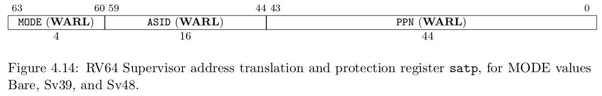
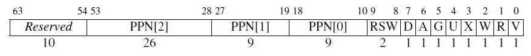

# 地址空间

----

> # risc-v 内存相关CSR寄存器
>
> 
>
> stap寄存器控制是否启用分页模式
>
> MODE选择特定的页表实现
>
> ASID是地址空间标识符 ==>用于进程控制
>
> PPN存储的是根页表所在的物理页号
>
> - MODE: 0是直接物理地址
> - MODE: 8 是SV39分页机制

> # SV39分页机制
>
> 
>
> 虚拟地址的39位会被转换为物理地址对应的56位。

> # SV39对应的页表项
>
> 
>
> - V 位决定了该页表项的其余部分是否有效（V = 1 时有效）。若 V = 0，则任何遍历
>   到此页表项的虚址转换操作都会导致页错误。
> - R、W 和 X 位分别表示此页是否可以读取、写入和执行。如果这三个位都是 0，
>   那么这个页表项是指向下一级页表的指针，否则它是页表树的一个叶节点。
> - U 位表示该页是否是用户页面。若 U = 0，则 U 模式不能访问此页面，但 S 模式
>   可以。若 U = 1，则 U 模式下能访问这个页面，而 S 模式不能。
> - G 位表示这个映射是否对所有虚址空间有效，硬件可以用这个信息来提高地址转
>   换的性能。这一位通常只用于属于操作系统的页面。
> - A 位表示自从上次 A 位被清除以来，该页面是否被访问过。
> - D 位表示自从上次清除 D 位以来页面是否被弄脏（例如被写入)。
> - RSW 域留给操作系统使用，它会被硬件忽略。
> - PPN 域包含物理页号，这是物理地址的一部分。若这个页表项是一个叶节点，那
>   么 PPN 是转换后物理地址的一部分。否则 PPN 给出下一节页表的地址

