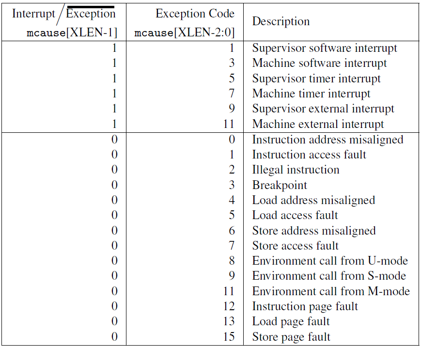

# 章节任务

----

默认情况下，发生所有异常（不论在什么权限模式下）的时候，控制权都会被移交到
M 模式的异常处理程序。RISC-V 提供了一种异常委托机制。通过该机制可以选择性地将中
断和同步异常交给 S 模式处理，而完全绕过 M 模式。

> # 解释
>
> mideleg（Machine Interrupt Delegation，机器中断委托）CSR 控制将哪些中断委托给 S模式。与 mip 和 mie 一样，mideleg 中的每个位对应于一个异常。例如，mideleg[5]对应于 S 模式的时钟中断，如果把它置位，S 模式的时钟中断将会移交 S 模式的异常处理程序，而不是 M 模式的异常处理程序。


正确进入 U 态后，程序的特征还应有：使用 S 态特权指令，访问 S 态寄存器后会报错。目前由于一些其他原因，这些问题不太好测试，请同学们可以自行测试这些内容（参考 [前三个测例](https://github.com/DeathWish5/rCore_tutorial_tests/tree/master/user/src/bin) ），描述程序出错行为，同时注意注明你使用的 sbi 及其版本。

> # 解释
>
> user程序:
>
> ```rust
> #[no_mangle]
>  fn main()->i32{
>     println!("user use sret!");
>     unsafe {
>         asm!("sret",
>         );
>     }
>     0
> }
> ```
>
> 错误提示：
>
> 


请结合用例理解 [trap.S](https://github.com/rcore-os/rCore-Tutorial-v3/blob/ch2/os/src/trap/trap.S) 中两个函数 `__alltraps` 和 `__restore` 的作用，并回答如下几个问题:

L40：刚进入 `__restore` 时，`a0` 代表了什么值。请指出 `__restore` 的两种使用情景。

> # 解释
>
> a0是在内核栈上压入构造好的trap上下文时返回的栈顶地址。
>
> __restore()第一次使用是在进入用户程序的时候我们需要从内核态切换到用户态，第二种使用是程序运行过程中发生异常/系统调用时进入内核态处理并恢复。

L46-L51：这几行汇编代码特殊处理了哪些寄存器？这些寄存器的的值对于进入用户态有何意义？请分别解释。

```gas
ld t0, 32*8(sp) 
ld t1, 33*8(sp)
ld t2, 2*8(sp)
csrw sstatus, t0   #此时sstatus的spp为user
csrw sepc, t1 #此时sepc中的值为用户程序的起始地址
csrw sscratch, t2 #用户栈栈顶位置
```

L53-L59：为何跳过了 `x2` 和 `x4`？

```gas
ld x1, 1*8(sp)
ld x3, 3*8(sp)
.set n, 5
.rept 27
   LOAD_GP %n
   .set n, n+1
.endr
```

> # 解答
>
> x2寄存器是sp的值，x4寄存器一般我们也不到。

L63：该指令之后，`sp` 和 `sscratch` 中的值分别有什么意义？

```gas
csrrw sp, sscratch, sp
交换后sp指向用户栈，sscratch指向内核栈
```

`__restore`：中发生状态切换在哪一条指令？为何该指令执行之后会进入用户态？

> # 解答
>
> sret
>
> sret指令执行后
>
> + CPU 会将当前的特权级按照 `sstatus` 的 `SPP` 字段设置为 U 或者 S ；
> + CPU 会跳转到 `sepc` 寄存器指向的那条指令，然后继续执行。


程序陷入内核的原因有中断和异常（系统调用），请问 riscv64 支持哪些中断 / 异常？如何判断进入内核是由于中断还是异常？描述陷入内核时的几个重要寄存器及其值。

> # 解释
>
> 
>
> - mtvec（Machine Trap Vector）它保存发生异常时处理器需要跳转到的地址。
> - mepc（Machine Exception PC）它指向发生异常的指令。
> - mcause（Machine Exception Cause）它指示发生异常的种类。
> - mie（Machine Interrupt Enable）它指出处理器目前能处理和必须忽略的中断。
> - mip（Machine Interrupt Pending）它列出目前正准备处理的中断。
> - mtval（Machine Trap Value）它保存了陷入（trap）的附加信息：地址例外中出错
>   的地址、发生非法指令例外的指令本身，对于其他异常，它的值为 0。
> - mscratch（Machine Scratch）它暂时存放一个字大小的数据。、
> - mstatus（Machine Status）它保存全局中断使能，

对于任何中断，`__alltraps` 中都需要保存所有寄存器吗？你有没有想到一些加速 `__alltraps` 的方法？简单描述你的想法。

